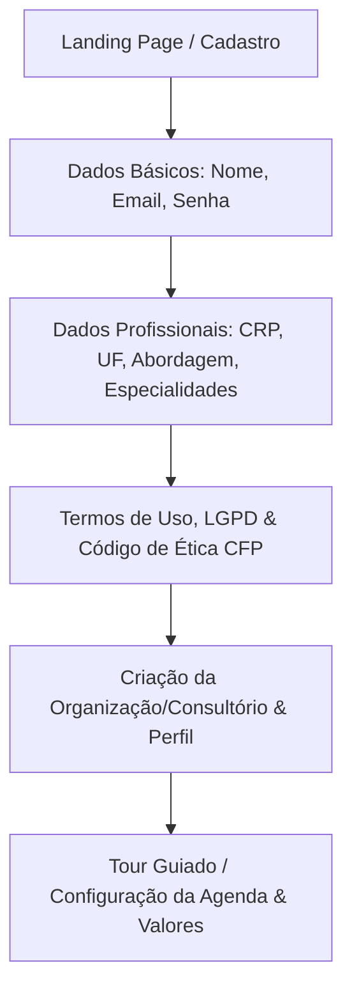

# Planejamento Estratégico e Arquitetural — PsiApp

## 🎯 Visão Geral do Projeto
O **PsiApp** é uma plataforma SaaS e aplicativo PWA/Mobile (Next.js + Supabase + Capacitor) voltada para psicólogos clínicos e seus pacientes, com foco em:
1. Gestão de Prontuário Eletrônico com Sigilo Rigoroso (CFP / LGPD).
2. Engajamento Ativo "Entre Sessões" (exercícios estruturados, monitoramento de humor, diário compartilhado/privado, ferramentas de autorregulação e SOS/Crise).
3. Automação Clínica e Suporte com IA Segura.

---

## 📊 Status Atual vs. Roadmap do Projeto

| Módulo / Fase | Status Atual | O Que Falta / Próximos Passos |
| :--- | :---: | :--- |
| **Fase 0: Fundação & Infra** | 🟢 **100% Concluído** | CI/CD Vercel ativo, Supabase Postgres + RLS provisionado, Build OK. |
| **Fase 1: Autenticação & Cadastro** | 🟡 **Parcial (Frontend Mock + Supabase Auth Base)** | Fluxo de onboarding completo de Psicólogos (validação CRP/e-Psi) e Pacientes (via convite seguro por link/WhatsApp). |
| **Fase 2: Gestão de Sessões & Prontuário** | 🟢 **Protótipo Avançado Funcional** | Registro de sessões em tempo real, notas privadas encriptadas, cronômetro de sessão e histórico longitudinal. |
| **Fase 3: Caixa de Ferramentas & Entre Sessões** | 🟢 **13 Protocolos Clínicos Prontos** | Interação direta durante a sessão (co-preenchimento ao vivo e compartilhamento de tela/exercício). |
| **Fase 4: Notificações & Mensageria** | ⚪ **Pendente** | Integração WhatsApp (Z-API/Evolution) para lembretes automáticos de consulta e alertas de exercícios. |
| **Fase 5: Faturamento & Cobrança** | ⚪ **Pendente** | Gateway de pagamento (Asaas/Stripe) para cobrança recorrente de planos de psicólogos e pagamentos de consultas por Pix. |
| **Fase 6: IA Clínica (Copiloto)** | 🟡 **Widget Base Ativo** | Transcrição de áudio com geração automática de rascunho de evolução SOAP/DAP e detecção de riscos. |

---

## 🏗️ 1. Fluxo de Cadastro e Registro de Novos Psicólogos

### 1.1 Etapas do Onboarding


1. **Step 1: Credenciais & Identidade**
   - E-mail profissional, senha com requisitos de alta entropia.
   - Verificação de e-mail (Magic Link ou OTP de 6 dígitos via Supabase Auth).
2. **Step 2: Credenciamento Profissional**
   - Número do CRP e Estado emissor (Ex: `06/123456 - SP`).
   - Campo para link do e-Psi (Cadastro Nacional de Psicólogos do CFP para atendimento online).
   - Abordagem teórica principal (TCC, ACT, DBT, Psicanálise, Humanista, Gestalt, Sistêmica, etc.).
3. **Step 3: Conformidade Ética e LGPD**
   - Assinatura digital dos termos de responsabilidade sobre sigilo profissional (Resoluções CFP nº 01/2009 e 04/2020).
4. **Step 4: Ativação e Personalização**
   - Configuração de duração padrão das sessões (ex: 50 min), link padrão de teleconsulta (Google Meet / Zoom / Link Próprio), e envio do primeiro convite a paciente.

---

## 👥 2. Processo de Cadastro de Pacientes & Registro de Sessões

### 2.1 Fluxo de Cadastro do Paciente (Convite Seguro)
1. **Adição pelo Psicólogo:**
   - O profissional insere: Nome completo, Nome social, E-mail, WhatsApp, data de nascimento e contato de emergência.
2. **Geração de Convite Criptografado:**
   - Link único de acesso (`https://psiapp-chi.vercel.app/convite/[token-uuid]`) enviado por e-mail ou WhatsApp.
3. **Primeiro Acesso do Paciente:**
   - O paciente clica, cria sua senha e preenche a anamnese inicial / aceita o termo de consentimento de teleatendimento.
   - Vinculação automática via RLS (`psychologist_patient_relationships`).

### 2.2 Ciclo de Vida do Registro de Sessão (Antes, Durante e Depois)

```
[Antes da Sessão] ➔ Revisão rápida do histórico, diário recente e humor do paciente
[Durante a Sessão] ➔ Modo "Em Atendimento": Anotações em tempo real + Ferramentas ao vivo
[Após a Sessão]   ➔ Fechamento da Evolução Clínica (SOAP) + Prescrição de Tarefas Entre Sessões
```

1. **Prontuário Estruturado (Método SOAP / DAP):**
   - **S (Subjetivo):** Queixas relatadas pelo paciente, falas marcantes.
   - **O (Objetivo):** Observações comportamentais, afeto, linguagem não-verbal.
   - **A (Avaliação/Análise):** Hipótese diagnóstica, conexões cognitivas/emocionais.
   - **P (Plano):** Intervenções planejadas para a próxima sessão e tarefas de casa.
2. **Segregação Rigorosa de Notas Privadas (Sigilo Absoluto):**
   - `session_private_notes`: Visível apenas ao psicólogo autenticado (bloqueado por RLS para qualquer outro usuário).

---

## 🛠️ 3. Ferramentas Integradas para Apoiar o Desenvolvimento da Sessão

### 3.1 Durante a Sessão (Co-criação Psicólogo + Paciente)
1. **Quadro Branco de Conceituação Cognitiva (TCC / ACT):**
   - Diagrama interativo onde terapeuta e paciente mapeiam juntos: *Situação ➔ Pensamento Automático ➔ Emoção ➔ Reação Fisiológica ➔ Comportamento*.
2. **Painel de Exposição Gradual (Hierarquia do Medo):**
   - Construção ao vivo da régua de Unidades Subjetivas de Desconforto (SUDS 0–100).
3. **Role-Play & Gravação de Cartões de Áudio:**
   - Gravação de lembretes e âncoras de voz durante a sessão para o paciente ouvir em momentos de crise.
4. **Cronômetro Clínico & Alertas Discretos:**
   - Contador de 50 min com aviso suave aos 40 min (para fechamento/debriefing) e 48 min (para encerramento).

---

## 💡 4. Novas Ferramentas e Módulos para Agregar ao PsiApp

1. **Copiloto de IA Transcritor & Sintetizador de Sessões (Whisper + Gemini):**
   - O psicólogo pode ditar ou gravar um resumo em áudio após a sessão de 1 minuto, e a IA formata automaticamente no modelo SOAP pronto para revisão e assinatura.
2. **Escalas Psicométricas Digitais Autoaplicáveis:**
   - **PHQ-9** (Rastreio de Depressão).
   - **GAD-7** (Rastreio de Ansiedade Generalizada).
   - **BDI-II / BAI** e **DASS-21** (Depressão, Ansiedade e Estresse) com geração de gráficos de evolução temporal.
3. **Módulo Financeiro & Emissão de Recibos/Notas:**
   - Controle de sessões pagas/pendentes, geração de recibos em PDF padrão CFP para reembolso em planos de saúde.
4. **Integração WhatsApp Bot (Disparos Automáticos):**
   - Confirmação de consulta 24h antes com botões "Confirmar" / "Desmarcar".
   - Lembrete amigável do registro de humor matinal/noturno.
5. **Painel de Supervisão Clínica:**
   - Espaço para psicólogos iniciantes compartilharem prontuários anonimizados com seus supervisores credenciados.
